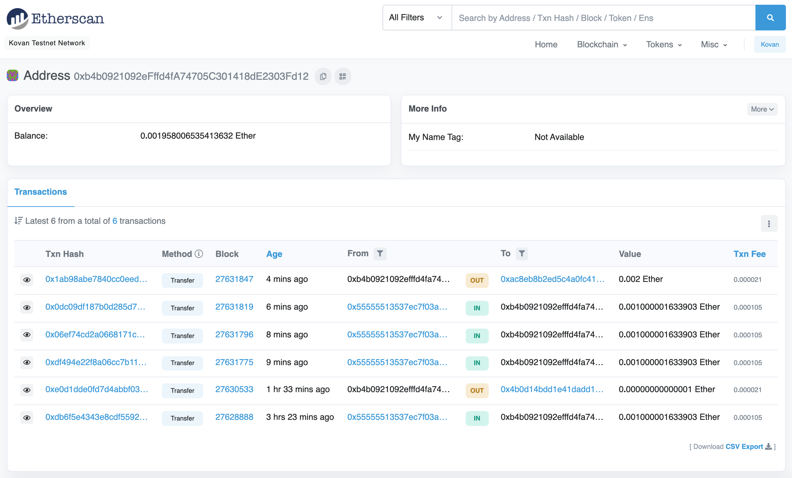
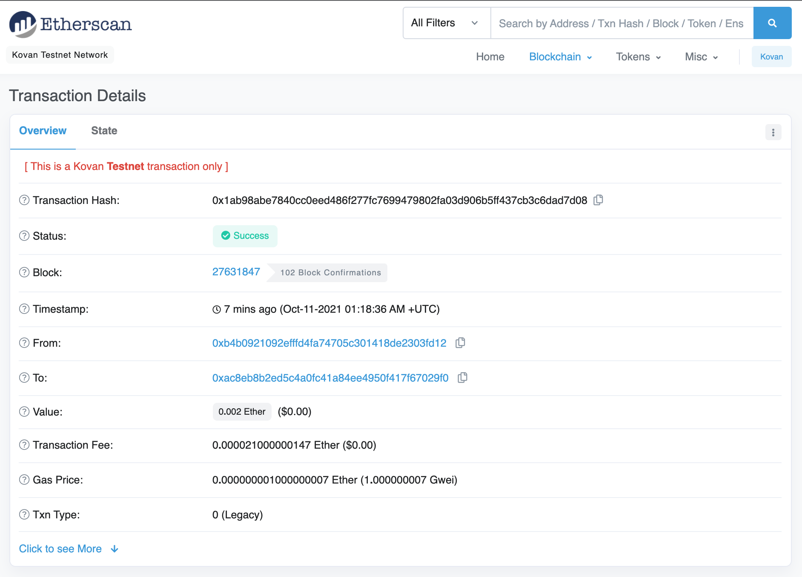
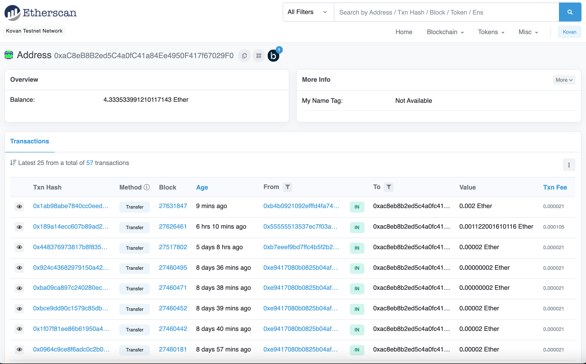

# Fintech Finder

This repo contains an prototype application that can be used to find, review, and select Fintech professionals.  The customer of this application can select and send cryptocurrency payments to their selected FinTech professional.

The application enables the customer to perform the following tasks:
* Generate an Ethereum account instance by using the customer's mnemonic seed phrase in their .env file.
* Fetch and display the account balance associated with the customer's Ethereum account address.
* Calculate the total value of an Ethereum transaction, including the gas estimate, that pays a Fintech Finder candidate for their work.
* Digitally sign a transaction that pays a Fintech Finder candidate, and send this transaction to the Kovan testnet.
* If the transaction is successful, display the transaction hash code associated with the validated blockchain transaction.
* If the transaction fails, display the error message for the transaction error that occurred.

---

## Technologies

* Streamlit: Open source web app framework.
* Web3.py: Library for connecting to and performing operations on Ethereum-based blockchains.
* mnemonic: Library for generating a 12- or 24-word mnemonic seed phrase based on the BIP-39 standard.
* bip44: Library for deriving hierarchical deterministic wallets from a seed phrase based on the BIP-44 standard.
* Infura API: An API that provides instant access to the Ethereum network over HTTPS (i.e., the web). You will need to create an account with Infura.
* dotenv: Module that loads environment variables from a .env file.


---

## Installation Guide

This application is meant to run in Python 3.7.

For Web3 you likely need to install Xcode if running on Mac, or Microsoft Visual C++ Build Tools when running on Windows.

After that, pip can be used to install the dependencies:
```
pip install web3==5.17
pip install mnemonic
pip install bip44
pip install streamlit
```

For the Infura API, you must create an account at https://infura.io/ and create a new project.

Next, you must place your 12- or 24- word mnemonic seed phrase and your Infura project ID into `SAMPLE.env` and rename to just `.env`

To start the Fintech Finder application, run `streamlit run fintech_finder.py` at a terminal.

---

## Example

Here is an example of customer address balance and history, shown on the Kovan Etherscan blockchain explorer, after Fintech Finder was used to sign a transaction and send funds to a Fintech professional:



Here is an example of the transaction details when the customer sent funds to the Fintech professional using the app:



Here is an example of the Fintech professional's address balance and history after their address received the funds:



---

## Contributors

Michael Danenberg

---

## License

MIT